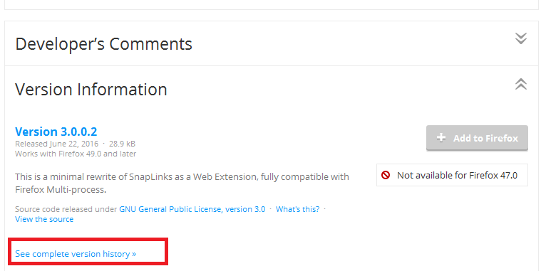

Минимальны джентльменский набор дополнений, стилей и настроек для **release** версии  
Если дополнение не совместимо с вашей версией Firefox можно поискать совместимую старую версию:  


#### Дополнения

**Note!** Значки некоторых дополнений могут прятаться на разных панелях или в меню настройки вида панелей.

[FindBar Tweak](https://addons.mozilla.org/ru/firefox/addon/findbar-tweak) - удобный поиск по странице с отметками найденного на полосе прокрутки.
<br>
[Add to Search Bar](https://addons.mozilla.org/RU/firefox/addon/add-to-search-bar) - добавления любой строки в панель поиска.
<br>
[Advanced Locationbar](https://addons.mozilla.org/ru/firefox/addon/advanced-locationbar) - быстрый переход по частям ссылки в адресной строке. Удобно для перехода на главную страницу.
<br>
[Classic Theme Restorer](https://addons.mozilla.org/ru/firefox/addon/classicthemerestorer) - настройка оформления. Можно уменьшить панели и кнопки. Имеет **множество** опций изменяющих вид и поведение Firefox (например может авто очищать текст строки поиска после запроса)
<br>
[Muter](https://addons.mozilla.org/Ru/firefox/addon/muter) - выключение звука от браузера. Нужно только, если в системе нету микшера звука.
<br>
[Resurrect Pages](https://addons.mozilla.org/ru/firefox/addon/resurrect-pages) - можно быстро получить ссылки на страницу в веб архиве и кэше поисковиков.
<br>
[Tab Mix Plus](https://addons.mozilla.org/ru/firefox/addon/tab-mix-plus) - управление поведением вкладок. Можно установить принудительный одноконный режим (всё только во вкладках). Функция перезагрузки вкладки по таймеру, переименование вкладок, горячие клавиши, прогресс загрузки для каждой вкладки отдельно, множество других функций.
<br>
[Tree Style Tab](https://addons.mozilla.org/ru/firefox/addon/tree-style-tab) или [Tab Tree](https://addons.mozilla.org/en-US/firefox/addon/tab-tree) - вкладки вертикально в виде дерева.
<br>
[TryAgain](https://addons.mozilla.org/ru/firefox/addon/tryagain) - если страница недоступна пытается грузить её снова. Ссылки на сервисы через которые можно проверить не доступна страница только у вас или у всех.
<br>
[uBlock Origin](https://addons.mozilla.org/ru/firefox/addon/ublock-origin) - блокировка рекламы и сбора статистики.
<br>
[UnMHT](https://addons.mozilla.org/ru/firefox/addon/unmht) - сохранение страницы одним файлом в формате .mht. Сохраняются и скрипты. На выбор: можно отключить диалоги во время сохранения.
<br>
[FoxyProxy Standard](https://addons.mozilla.org/ru/firefox/addon/foxyproxy-standard) - быстрое и удобное управление прокси.
<br>
[ContextMenuPlus](https://addons.mozilla.org/ru/firefox/addon/contextmenuplus) - копирование текста без форматирования, имени ссылки и др.
<br>
[ExportHTMLFolder](https://addons.mozilla.org/RU/firefox/addon/exporthtmlfolder) - экспорт отдельных каталогов закладок.
<br>
[FlashGot Mass Downloader](https://addons.mozilla.org/ru/firefox/addon/flashgot) - выбор стороннего менеджера загрузки файлов. Поиск ссылок на видео.
<br>
[Greasemonkey](https://addons.mozilla.org/ru/firefox/addon/greasemonkey) - менеджер пользовательских скриптов javascript.
<br>
[Zoom Page](https://addons.mozilla.org/ru/firefox/addon/zoom-page) - удобное управление масштабом страницы и отдельно масштабом текста. Умеет подгонять страницу по ширине окна (ужимать).
<br>
[User Agent Overrider](https://addons.mozilla.org/ru/firefox/addon/user-agent-overrider) - можно притворяться мобильной версией Firefox чтобы смотреть видео на некоторых сайтах без Flash Player.
<br>
[NoScript](https://addons.mozilla.org/ru/firefox/addon/noscript) - можно отключить видео/аудио на сайтах, что в дороге при дорогом и медленном трафике сотовых операторов сильно помогает. Скрипты конечно нужно включить, без них сегодня половина сайтов работать не будет. Если на некоторых сайтах будет тормозить отключите обнаружение XSS атак.
<br>
[Edit Bookmark Plus](https://addons.mozilla.org/en-US/firefox/addon/edit-bookmark-plus) - при добавлении закладок меню закладок запоминает состояние. Это избавляет от множества лишних действий.
<br>
[Link Properties Plus](https://addons.mozilla.org/ru/firefox/addon/link-properties-plus) - предоставляет расширенные свойства для ссылок: размер файла по ссылке, дату последнего изменения и т.п.
<br>
[Select like a Boss](https://addons.mozilla.org/en-US/firefox/addon/select-like-a-boss) - позволяет выделять ссылки без зажатия клавиши ```alt```.
<br>
[Image Picker](https://addons.mozilla.org/en-US/firefox/addon/image-picker) и [Double-click Image Downloader](https://addons.mozilla.org/en-US/firefox/addon/double-click-image-download/) - быстрое сохранение изображений (по клику, перетаскиванию, сочетанием клавиш). Можно сохранить все изображения на странице.
<br>
[Toolbar Buttons](https://addons.mozilla.org/ru/firefox/addon/toolbar-buttons/) - набор множества кнопок на разные случаи.
<br>
[Dictionary Switcher](https://addons.mozilla.org/en-uS/firefox/addon/dictionary-switcher/) - индикатор текущего словаря, переключение и другие параметры.
<br>
[New Plugin Disabler](https://addons.mozilla.org/en-US/firefox/addon/new-plugin-disabler/) - отключает автоустановку плагинов, включить их можно вручную.
<br>
[Snap Links Plus](https://addons.mozilla.org/en-US/firefox/addon/SnapLinksPlus/) - можно прямоугольником выделить ссылки и так открыть группу.
<br>
[Tile Tabs](https://addons.mozilla.org/en-us/firefox/addon/tile-tabs/) - можно разбить окно на части и открыть в каждой разные страницы.
<br>
[Multifox](https://addons.mozilla.org/En-us/firefox/addon/multifox/) - можно зайти на один и тот же сайт одновременно с разных ников. То есть создаёт отдельный профиль с куки и др. информацией о регистрации.
<br>
[Print Edit](https://addons.mozilla.org/ru/firefox/addon/print-edit/) - сохранение страницы как .PDF, редактирование перед печатью и настройки параметров печати.
<br>
[Nightly Tester Tools](https://addons.mozilla.org/en-Us/firefox/addon/nightly-tester-tools/) - можно принудительно включить совместимость дополнений.
<br>
[English-Russian dictionary](https://addons.mozilla.org/en-us/firefox/addon/english-russian-dict/) - совмещенный словарь англ. + рус.
<br>
[Stylish](https://addons.mozilla.org/ru/firefox/addon/stylish/) - можно писать и применять стили CSS к интерфейсу и сайтам.
<br>
[tabTooltip](https://addons.mozilla.org/ru/firefox/addon/tabtooltip/) - при наведении на вкладку показывает её адрес.
<br>
[Screengrab (fix version)](https://addons.mozilla.org/en-US/firefox/addon/screengrab-fix-version/) - скриншот всей страницы, видимой области или её кусочка.
<br>
[clear the search bar](https://addons.mozilla.org/en-us/firefox/addon/clear-the-search-bar/) - очистка поисковой строки после запроса.
<br>
[Drag-n-Drop Multiple Files](https://addons.mozilla.org/ru/firefox/addon/drag-n-drop-multiple-files) - позволяет одновременно перетаскивать несколько страницы на Firefox для их открытия (по умолчанию открывается только одна)
<br>
[Random Agent Spoofer](https://addons.mozilla.org/en-US/firefox/addon/random-agent-spoofer/) - даёт возможность выбора часового пояса для Firefox, который виден сайту. И позволяет отключать скрытую отправку некоторых данных. Например, можно подменить локальное время компьютера, которое сайт может получить через JavaScript. А вот случайный профиль для маскировки лучше отключить - это глупость (поставьте Real Profile - реальный профиль).
<br>
[FireGestures](https://addons.mozilla.org/ru/firefox/addon/firegestures) - можно вешать действия на жесты.
<br>
[Hide Caption Titlebar Plus](https://addons.mozilla.org/ru/firefox/addon/hide-caption-titlebar-plus-sma/) - прячет заголовок окна (экономит место), делает панель меню появляющуюся по ```Alt``` выпадающей и страница не прыгает при её открытии. Под многими дистрибутивами Linux это единственно удобный способ скрыть заголовок окна.
<br>
[Add Bookmark Here 2](https://addons.mozilla.org/ru/firefox/addon/add-bookmark-here-2) - в каждое меню закладок добавляет кнопку "добавить закладку сюда", что экономит время на добавления (так как Mozilla так и не сделала удобное меню для добавления)
<br>
[DownThemAll!](https://addons.mozilla.org/en-US/firefox/addon/downthemall/) - менеджер загрузок, хорошо интегрирован с Firefox и удобен (особенно если использовать один профиль на разных машинах, чтобы не менять менеджеры загрузок).  
[Auto Unload Tab](https://addons.mozilla.org/ru/firefox/addon/auto-unload-tab/) - может выгружать вкладки по таймеру, экономит ресурсы.  
[Tab Groups](https://addons.mozilla.org/ru/firefox/addon/tab-groups-panorama/) - переключение между группами вкладок  
[Chrome Store Foxified](https://addons.mozilla.org/en-US/firefox/addon/chrome-store-foxified/) - можно устанавливать некоторые расширения для Chrome в Firefox (из Chrome Store)

#### Настройки для удобства

Скопировать файл [user.js](user.js) с моими настройками для удобства в каталог профиля ```profile/user.js```.  
Для Firefox **под Android** можно менять только вручную или использовать дополнения (поиск по тегу [Security & Privacy](https://addons.mozilla.org/en-US/android/extensions/security-privacy/))

[Fox](https://github.com/The-OP/Fox), [RamiRosenfeld](https://github.com/RamiRosenfeld/Rosenfox), [Список русского форума](https://forum.mozilla-russia.org/viewtopic.php?id=36226), [mozillazine.org](http://kb.mozillazine.org/Firefox_:_FAQs_:_About:config_Entries) - описаны дополнительные настройки, в том числе для приватности

* Другое:
	* Установить через дополнение ```Classic Theme Restorer``` строку поиска в виде списка (старый вид поисковой строки). Иначе названий поисковиков в панели поиска не будет и вам придется запоминать иконки.
	* В закладки Firefox компания в целях рекламы может добавить подписки RSS и Atom на новости в качестве рекламы. Проверьте их и удалите.
	* Не устанавливайте темы, они кривые, а легковесные могут и обновление проверять.

#### Управление

**Обратите внимание на эту подборку!** Некоторые сочетания клавиш заменяют дополнения! Все сочетания клавиш можно посмотреть на [официальной странице справки для Hot Keys](https://support.mozilla.org/en-US/kb/keyboard-shortcuts-perform-firefox-tasks-quickly?redirectlocale=en-US&as=u&redirectslug=Keyboard+shortcuts&utm_source=inproduct)<br>
**Note!** Некоторые дополнения могут блокировать или менять стандартные сочетания клавиш.

* ```alt``` + ```зажатая левая клавиша мыши``` - выделять куски ссылок или элементов которые перетаскиваются можно (не работает если копирование блокировано скриптами или на блок с текстом наложен сверху прозрачный блок)
* ```shift``` + ```правая кнопка мыши``` - вызвать блокированное скриптом контекстное меню
* Сохранить страницу в виде изображения можно поставив галочку в настройках панели разработчика. (```ctrl``` + ```shift``` + ```I```)
* ```alt``` - вызвать скрытую панель меню
* ```ctrl``` + ```протащите вкладку по панели вкладок``` - клонировать вкладку
* ```F5``` - обновить вкладку
* ```F7``` - каретка на любом содержимом сайта включается и выключается (не работает если копирование блокировано скриптами или на блок с текстом наложен сверху прозрачный блок)
* Чтобы открыть адрес или результаты поиска в новой вкладке нажмите ```alt``` + ```enter```
* ```ctrl``` + ```клик по ссылке``` - открыть новую вкладку, работает и на закладках
* Если значка для управления установленным дополнением не видно ни в панели значков, ни на открытых панелях, то проверьте скрытые панели (откройте их). Панели можно открыть/закрыть кликнув правой кнопкой мыши по любой панели (не текстовому полю или значку)
* ```средней кнопкой мыши на вкладке``` - закрыть вкладку можно
* Если в Firefox сохранено несколько паролей, то кликнув 2 раза по текстовой строке для ввода логина можно выбрать любой из них
* ```2 раза кликнув по звездочке```  (или ```ctrl``` + ```D```) - выбрать в каком каталоге сохранится закладка
* ```Правая кнопка мыши``` на иконки ```стрелки вперед/назад``` - можно сразу перейти на любую страницу из истории переходов
* ```ctrl``` + ```F``` - можно открыть панель поиска по странице
* Найти ссылку на любое проигрываемое видео/аудио можно через раздел "Сеть" в панели разработчика: ```ctrl``` + ```shift``` + ```I```
* Старайтесь не набирать важный текст в текстовых полях, используйте блокнот, а затем копируйте текст
* ```ctrl``` + ```удерживать Левая Клавиша Мыши``` - можно выделять таблицы
* ```ctrl``` + ```T``` - открыть новую вкладку
* ```ctrl``` + ```F4``` - зыкрыть текущую вкладку

#### Bookmarklets

Это закладка с JavaScript внедряющимся на страницу и выполняющимся в момент нажатия на закладку.
Для создания bookmarklet нужно создать закладку со скриптом в строке адреса (поле location):
```
javascript:void((function () {
	alert('test');
})());
```  
Во время создания код bookmarklet преобразуется в base64 (URI Encoding).

[marklets.com](http://marklets.com/) - репозитории готовых bookmarklets, код не проверяет никто.

#### Другие настройки

* [Chrome_URLs](http://kb.mozillazine.org/Chrome_URLs) - ссылки на открытие закладок, загрузок и т.д. во вкладках вместо окон
* ```Firefox\Browser\chrome\icons\default\main-window.ico``` - меняем иконку Firefox

#### Разработка

* ```ctrl + shift + i``` - встроенные инструменты разработчика Firefox на сегодня имеют почти все возможности устаревших дополнений и большей части FireBug.
* [FireBug](https://addons.mozilla.org/en-US/firefox/addon/firebug) - основной инструмент, инспекция html, javascript, css, консоль, cookie и др. хранилищ, запросов. Множество [дополнений для FireBug](http://getfirebug.com/wiki/index.php/Firebug_Extensions)
	* У консоли FireBug есть дополнительные возможности:
		* [Функции логирование](https://getfirebug.com/wiki/index.php/Console_API) <br>
		* [Команды командной строки](https://getfirebug.com/wiki/index.php/Command_Line_API) через которые можно находить функции, элементы DOM, выполнять скрипт, отслеживать вызов функций, трассировка вызовов, получить всех слушателей события, просматривать содержимое объектов
* [ColorZilla](https://addons.mozilla.org/en-US/firefox/addon/colorzilla) - инструменты для подборки цветов.
* Устаревшие:
	* [Tiny JavaScript Debugger](https://addons.mozilla.org/en-US/firefox/addon/tiny-javascript-debugger) - дебагер javascript
	* [CSS Usage](https://addons.mozilla.org/en-US/firefox/addon/css-usage/) - дополнение для FireBug, просмотр стилей и информации о них.
	* [FirePath](https://addons.mozilla.org/en-US/firefox/addon/firepath) - дополнение для FireBug, позволяет находить, проверять, редактировать XPath, CSS и JQuery селекторы.
	* [Javascript Deminifier](https://addons.mozilla.org/en-US/firefox/addon/javascript-deminifier/) - красиво формотирует javascript код.
	* [Web Developer](https://addons.mozilla.org/en-US/firefox/addon/web-developer/) - много инструментов, от линейки до автоформатирования javascript, отключения куков, css, валидации и др.
	* [FireStorage Plus!](https://addons.mozilla.org/en-US/firefox/addon/firestorage-plus) - дополнение для FireBug для инспекции HTML5 Local Storage и подобного.

#### Дополнения для приватности

* [Random Agent Spoofer](https://addons.mozilla.org/en-US/firefox/addon/random-agent-spoofer)
* [uMatrix](https://addons.mozilla.org/ru/firefox/addon/umatrix/)
* [RequestPolicy Continued](https://addons.mozilla.org/ru/firefox/addon/requestpolicy-continued/)
* [Policeman](https://addons.mozilla.org/en-us/firefox/addon/policeman/)
* [Advanced Cookie Manager](https://addons.mozilla.org/en-us/firefox/addon/cookie-manager/)
* [Cookies Manager+](https://addons.mozilla.org/en-us/firefox/addon/cookies-manager-plus/)
* [New Plugin Disabler](https://addons.mozilla.org/en-us/firefox/addon/new-plugin-disabler/)
* [RightToClick](https://addons.mozilla.org/en-US/firefox/addon/righttoclick/)
* [NoScript Security Suite](https://addons.mozilla.org/en-US/firefox/addon/noscript/)
* [uBlock Origin](https://addons.mozilla.org/en-US/firefox/addon/ublock-origin/)
* [Cookie Monster](https://addons.mozilla.org/en-US/firefox/addon/cookie-monster/)
* [Cookie Controller](https://addons.mozilla.org/ru/firefox/addon/cookie-controller/)
* [BetterPrivacy](https://addons.mozilla.org/en-US/firefox/addon/betterprivacy/)
* [Clean Links](https://addons.mozilla.org/en-US/firefox/addon/clean-links/)
* [Google search link fix](https://addons.mozilla.org/en-US/firefox/addon/google-search-link-fix/)
* [RefControl](https://addons.mozilla.org/en-US/firefox/addon/refcontrol/)
* [HTTPS Everywhere](https://addons.mozilla.org/en-us/firefox/addon/https-everywhere/)
* [Firebug](https://addons.mozilla.org/ru/firefox/addon/firebug/)
* [FireStorage Plus](https://addons.mozilla.org/en-us/firefox/addon/firestorage-plus/)
* [UAControl](https://addons.mozilla.org/ru/firefox/addon/uacontrol/)
* [SSleuth](https://addons.mozilla.org/en-US/firefox/addon/ssleuth/)
* [Self-Destructing Cookies](https://addons.mozilla.org/ru/firefox/addon/self-destructing-cookies/)
* [Redirector](https://addons.mozilla.org/ru/firefox/addon/redirector/)

#### Исследование

* [HackBar](https://addons.mozilla.org/de/firefox/addon/hackbar/)
* [SQL Inject Me](https://addons.mozilla.org/en-US/firefox/addon/sql-inject-me/)
* [XSS Me](https://addons.mozilla.org/en-US/firefox/addon/xss-me/)
* [Tamper Data](https://addons.mozilla.org/en-US/firefox/addon/tamper-data/)
* [CryptoFox](https://addons.mozilla.org/en-US/firefox/addon/cryptofox/)
* [Modify Headers](https://addons.mozilla.org/en-US/firefox/addon/modify-headers/)
* [WorldIP - Geo Add-on with Security Features](https://addons.mozilla.org/en-US/firefox/addon/worldip/)

#### Установка

* [Tor Browser](https://www.torproject.org/projects/torbrowser.html.en)
* [Pale Moon](https://www.palemoon.org/)
* [IceCat](http://ftp.gnu.org/gnu/gnuzilla/)
* [Firefox](https://ftp.mozilla.org/pub/firefox/)
* [Firefox EME](https://ftp.mozilla.org/pub/firefox/)
* [Firefox ESR](https://ftp.mozilla.org/pub/firefox/)
* [Firefox Developer Edition](https://www.mozilla.org/ru/firefox/developer/)

#### Разработка стилей CSS для Firefox (и не только)

* [Stylish](https://addons.mozilla.org/ru/firefox/addon/stylish/) - можно писать и применять стили CSS к интерфейсу и сайтам.
* [DOM Inspector](https://addons.mozilla.org/en-us/firefox/addon/dom-inspector-6622/)
* [Element Inspector](https://addons.mozilla.org/en-Us/firefox/addon/element-inspector/)
* [InspectorWidget](https://addons.mozilla.org/en-us/firefox/addon/inspectorwidget/)
* [Stacked Inspector](https://addons.mozilla.org/en-US/firefox/addon/stacked-inspector/)
* Статьи про стилеписание для Firefox:
	* [wiki для Stylish](https://github.com/JasonBarnabe/stylish/wiki)
	* [userstyles.org](https://userstyles.org/) - официальный репозиторий с автоудалением вредных стилей (со встроенными скриптами XBL)
	* [CSS стили поддерживаемые Firefox](https://developer.mozilla.org/en-US/docs/Web/CSS/Reference)
	* [дополнительные CSS от Mozilla](https://developer.mozilla.org/en-US/docs/Web/CSS/Mozilla_Extensions)
	* [Описание userChrome.css](http://kb.mozillazine.org/UserChrome.css) - встроенная функция, файл для применения стилей к браузеру для работы с CSS
	* [Описание userContent.css](http://kb.mozillazine.org/UserContent.css) - встроенная функция, файл для применения стилей к сайтам для работы с CSS
	* [Уроки стилистики (CSS)](http://web.archive.org/web/20130928163532/https://forum.mozilla-russia.org/viewtopic.php?id=49078)
* [Browser Toolbox](https://developer.mozilla.org/en-US/docs/Tools/Browser_Toolbox) - встроенный инструмент Firefox для стилеписания и разработки дополнений
