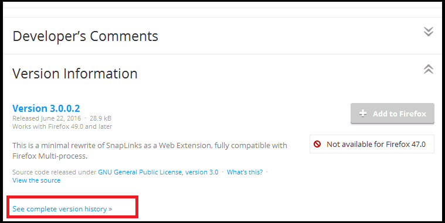

Раньше тут был минимальны набор дополнений, стилей и настроек для **release** версии. К сожалению **Mozilla удалила поддержку старого API** и многие уникальные расширения перестали работать. Это вынуждает меня перейти на **ESR** ветку, скачать [тут](https://www.mozilla.org/en-US/firefox/organizations/all/) <sub>(останусь на ней пока ситуация с **release** версией не стабилизируется)</sub>  
Если дополнение не совместимо с вашей версией Firefox можно поискать совместимую старую версию:  


#### Дополнения

**Note!** Значки некоторых дополнений могут прятаться на разных панелях или в меню настройки вида панелей.

[FindBar Tweak](https://addons.mozilla.org/ru/firefox/addon/findbar-tweak) - удобный поиск по странице с отметками найденного на полосе прокрутки.
<br>
[Add to Search Bar](https://addons.mozilla.org/RU/firefox/addon/add-to-search-bar) - добавления любой строки в панель поиска.
<br>
[Advanced Locationbar](https://addons.mozilla.org/ru/firefox/addon/advanced-locationbar) - быстрый переход по частям ссылки в адресной строке. Удобно для перехода на главную страницу.
<br>
[Classic Theme Restorer](https://addons.mozilla.org/ru/firefox/addon/classicthemerestorer) - настройка оформления. Можно уменьшить панели и кнопки. Имеет **множество** опций изменяющих вид и поведение Firefox (например может авто очищать текст строки поиска после запроса)
<br>
[Resurrect Pages](https://addons.mozilla.org/ru/firefox/addon/resurrect-pages) - можно быстро получить ссылки на страницу в веб архиве и кэше поисковиков.
<br>
[Tab Mix Plus](https://addons.mozilla.org/ru/firefox/addon/tab-mix-plus) - Можно установить принудительный одноконный режим (всё только во вкладках). Функция перезагрузки вкладки по таймеру, переименование вкладок, горячие клавиши, прогресс загрузки для каждой вкладки отдельно, множество других функций.
<br>
[Tree Style Tab](https://addons.mozilla.org/ru/firefox/addon/tree-style-tab) или [Tab Tree](https://addons.mozilla.org/en-US/firefox/addon/tab-tree) - вкладки вертикально в виде дерева. Оба часто имеют баги или могут ломаться с обновлениями.
<br>
[ErrorZilla Plus](https://addons.mozilla.org/ru/firefox/addon/errorzilla-plus) - если страница недоступна пытается грузить её снова. Ссылки на сервисы через которые можно проверить не доступна страница только у вас или у всех.
<br>
[uBlock Origin](https://addons.mozilla.org/ru/firefox/addon/ublock-origin)<sub>(лучшая замена для AdBlock Plus)</sub> - блокировка рекламы и сбора статистики. <sub>В связи с тем, что подписки по умолчанию блокируют некоторые сайты используемые многими пользователями далее идет описание правильной настройки _uBlock Origin_. <em>**Настройка подписок:**</em> В настройках дополнения ```отключить подписки```: **1) uBlock filters – Badware risks**, **2) Peter Lowe’s Ad server list‎**, **3) Malware Domain List‎**, **4) Malware domains‎**. ```Включить подписки```: **1) Basic tracking list by Disconnect‎**, __2) RUS: RU AdList__. Остальные подписки по умолчанию. ```Отключите встроенные функции Firefox```, который дублируют подписки _uBlock Origin_: **1) В настройках Firefox на вкладке "Защита" (Security) снять галочки с "Блокировать опасные сайты/загрузки", "Защита от мошенничества"**, **2) В настройках Firefox на вкладке "Приватность" (Privacy) снять галочку "Защита от отслеживания в приватном окне".**</sub>
<br>
[UnMHT](https://addons.mozilla.org/ru/firefox/addon/unmht) - сохранение страницы одним файлом в формате .mht. Сохраняются и скрипты. На выбор: можно отключить диалоги во время сохранения, отключить сохранение Flash и video/audio.
<br>
[FoxyProxy Standard](https://addons.mozilla.org/ru/firefox/addon/foxyproxy-standard) - быстрое и удобное управление прокси.
<br>
[ContextMenuPlus](https://addons.mozilla.org/ru/firefox/addon/contextmenuplus) - копирование текста без форматирования, имени ссылки и др.
<br>
[ExportHTMLFolder](https://addons.mozilla.org/RU/firefox/addon/exporthtmlfolder) - экспорт отдельных каталогов закладок.
<br>
[FlashGot Mass Downloader](https://addons.mozilla.org/ru/firefox/addon/flashgot) - выбор стороннего менеджера загрузки файлов. Поиск ссылок на видео. <sub>(у FlashGot очень раздражающие сочетания клавиш, которые мешают использовать ```Alt```, их можно отключить в настройках)</sub>
<br>
[Greasemonkey](https://addons.mozilla.org/ru/firefox/addon/greasemonkey) или [Violentmonkey](https://addons.mozilla.org/en-US/firefox/addon/violentmonkey/) - менеджер пользовательских скриптов javascript.
<br>
[NoSquint Plus](https://addons.mozilla.org/ru/firefox/addon/nosquint-plus) или [Zoom Page WE](https://addons.mozilla.org/en-US/firefox/addon/zoom-page-we/) - удобное управление масштабом страницы и отдельно масштабом текста. Умеет подгонять страницу по ширине окна (ужимать).
<br>
[User Agent Overrider](https://addons.mozilla.org/ru/firefox/addon/user-agent-overrider) - можно притворяться мобильной версией Firefox чтобы смотреть видео на некоторых сайтах без Flash Player.
<br>
[NoScript](https://addons.mozilla.org/ru/firefox/addon/noscript) - можно отключить видео/аудио на сайтах, что в дороге при дорогом и медленном трафике сотовых операторов сильно помогает. Скрипты конечно нужно включить, без них сегодня половина сайтов работать не будет. Если на некоторых сайтах будет тормозить отключите обнаружение XSS атак.
<br>
[Edit Bookmark Plus](https://addons.mozilla.org/en-US/firefox/addon/edit-bookmark-plus) - при добавлении закладок меню закладок запоминает состояние. Это избавляет от множества лишних действий.
<br>
[Link Properties Plus](https://addons.mozilla.org/ru/firefox/addon/link-properties-plus) - предоставляет расширенные свойства для ссылок: размер файла по ссылке, дату последнего изменения и т.п.
<br>
[Select like a Boss](https://addons.mozilla.org/en-US/firefox/addon/select-like-a-boss) - позволяет выделять ссылки без зажатия клавиши ```alt```.
<br>
[Image Picker](https://addons.mozilla.org/en-US/firefox/addon/image-picker) и [Double-click Image Downloader](https://addons.mozilla.org/en-US/firefox/addon/double-click-image-download/) - быстрое сохранение изображений (по клику, перетаскиванию, сочетанием клавиш). Можно сохранить все изображения на странице.
<br>
[Toolbar Buttons](https://addons.mozilla.org/ru/firefox/addon/toolbar-buttons/) - набор множества кнопок на разные случаи.
<br>
[Dictionary Switcher](https://addons.mozilla.org/en-uS/firefox/addon/dictionary-switcher/) - индикатор текущего словаря, переключение (автоматическое или нет) и другие параметры.
<br>
[New Plugin Disabler](https://addons.mozilla.org/en-US/firefox/addon/new-plugin-disabler/) - отключает автоустановку плагинов, включить их можно вручную.
<br>
[Tile Tabs](https://addons.mozilla.org/en-us/firefox/addon/tile-tabs/) - можно разбить окно на части и открыть в каждой разные страницы.
<br>
[Multifox](https://addons.mozilla.org/En-us/firefox/addon/multifox/) - можно зайти на один и тот же сайт одновременно с разных ников. То есть создаёт отдельный профиль с куки и др. информацией о регистрации.
<br>
[Print Edit](https://addons.mozilla.org/ru/firefox/addon/print-edit/) - сохранение страницы как .PDF, редактирование перед печатью и настройки параметров печати.
<br>
[Disable Add-on Compatibility Checks (Version 40+)](https://addons.mozilla.org/ru/firefox/addon/checkcompatibility2/) - можно принудительно включить совместимость дополнений. Дополнения будут работать на разных операционных системах без "проверки совместимости" через интернет. И если они сделаны для старой версии.
<br>
[Объединённый словарь русской орфографии](https://addons.mozilla.org/en-US/firefox/addon/unified-russian-english-spell/) - совмещенный словарь англ. + рус. <sub>При выборе словаря (клик правой кнопкой мыши на поле ввода) этот словарь имеет название "русский" хотя проверяет на двух языках сразу.</sub>
<br>
[StylRRR ](https://addons.mozilla.org/en-US/firefox/addon/stylrrr/) - можно писать и применять стили CSS к интерфейсу и сайтам. <sub>(не путайте с [Stylish](https://addons.mozilla.org/ru/firefox/addon/stylish/) - это когда-то хорошее дополнение может самовольно проверять обновления или отправлять статистику, сейчас оно ненадежно и к тому же хранит стили в .sqlite формате, что сильно затрудняет их редактирование при искажение интерфейса браузера)</sub>
<br>
[tabTooltip](https://addons.mozilla.org/ru/firefox/addon/tabtooltip/) - при наведении на вкладку показывает её адрес.
<br>
[Screengrab (fix version)](https://addons.mozilla.org/en-US/firefox/addon/screengrab-fix-version/) - скриншот всей страницы, видимой области или её кусочка.
<br>
[clear the search bar](https://addons.mozilla.org/en-us/firefox/addon/clear-the-search-bar/) - очистка поисковой строки после запроса.
<br>
[FireGestures](https://addons.mozilla.org/ru/firefox/addon/firegestures) или [Mouse Gestures Suite](https://addons.mozilla.org/ru/firefox/addon/mouse-gestures-suite) - можно вешать действия на жесты.
<br>
[Hide Caption Titlebar Plus](https://addons.mozilla.org/ru/firefox/addon/hide-caption-titlebar-plus-sma/) - прячет заголовок окна (экономит место), делает панель меню появляющуюся по ```Alt``` выпадающей и страница не прыгает при её открытии. Под многими дистрибутивами Linux это единственно удобный способ скрыть заголовок окна.
<br>
[Add Bookmark Here 2](https://addons.mozilla.org/ru/firefox/addon/add-bookmark-here-2) - в каждое меню закладок добавляет кнопку "добавить закладку сюда", что экономит время на добавления (так как Mozilla так и не сделала удобное меню для добавления)
<br>
[DownThemAll!](https://addons.mozilla.org/en-US/firefox/addon/downthemall/) - менеджер загрузок, хорошо интегрирован с Firefox и удобен <sub>(особенно если использовать один профиль на разных машинах, чтобы не менять менеджеры загрузок)</sub>. Дополнение к нему [DownThemAll! AntiContainer](https://addons.mozilla.org/ru/firefox/addon/downthemall-anticontainer/) позволяет скачивать файлы с сайтов, которые не дают прямых ссылок и скачиваются только браузером.  
[Auto Unload Tab](https://addons.mozilla.org/ru/firefox/addon/auto-unload-tab/) - может выгружать вкладки по таймеру, экономит ресурсы.  
[Tab Groups](https://addons.mozilla.org/ru/firefox/addon/tab-groups-panorama/) или [Simplified Tab Groups](https://addons.mozilla.org/EN-us/firefox/addon/tab-groups) - переключение между группами вкладок.
[Chrome Store Foxified](https://addons.mozilla.org/en-US/firefox/addon/chrome-store-foxified/) - можно устанавливать некоторые расширения для Chrome в Firefox (из Chrome Store)  
[Decentraleyes](https://addons.mozilla.org/ru/firefox/addon/decentraleyes/) - встраивает набор некоторых популярных javascript библиотек в Firefox, так что при открытии страниц библиотеки не загружаются снова из интернета и не происходит проверки на их актуальность (нету лишних запросов в интернет). Экономит трафик, защищает от отслеживания, ускоряет загрузку страниц.  
[Multi Links Plus](https://addons.mozilla.org/ru/firefox/addon/multi-links-plus/) или [Snap Links Plus](https://addons.mozilla.org/en-US/firefox/addon/SnapLinksPlus/) - можно прямоугольником выделить ссылки и так открыть, копировать, добавить в закладки группу ссылок.  
[YouTube High Definition](https://addons.mozilla.org/ru/firefox/addon/youtube-high-definition/) - настройка youtube, установка качества по умолчанию, отключение авто воспроизведения и другое  
[MuteTab](https://addons.mozilla.org/en-US/firefox/addon/mutetab/) - можно отключить звук во всех вкладках по умолчанию и включать только вручную  
[Vertical Tabs Reloaded](https://addons.mozilla.org/en-US/firefox/addon/vertical-tabs-reloaded/) - вкладки вертикально, альтернатива глючным дополнениям для древовидных вкладок <sub>(оформление настраивается через настройки)</sub> У этого дополнения может проявляться баг со скрытием заголовка окна, исправляется использованием дополнения [Hide Caption Titlebar Plus](https://addons.mozilla.org/ru/firefox/addon/hide-caption-titlebar-plus-sma/)  
[Google search link fix](https://addons.mozilla.org/en-US/firefox/addon/google-search-link-fix/) - чистит ссылки в поисковиках Google, Yandex от переадресации. На деле приватность не защищает, но убирает раздражающую переадресацию и переход по ссылке станет быстрее.

#### Список дополнений, стилей и настроек для Firefox 57 и новее (тестовый вариант)

Пока дополнения для новых версий Firefox не стабильны (и возможно никогда не станут).

[Web ScrapBook](https://addons.mozilla.org/en-US/firefox/addon/web-scrapbook/) - позволяет сохранять страницы одним файлом и открывать их (включая изображения, скрипты etc). Поддерживает формат .maff, не поддерживает .mht. <br>
[Custom CSS tweaks for Firefox 57+](https://github.com/Aris-t2/CustomCSSforFx) - набор стилей и настроек Firefox, некая замена старым дополнения для настройки, новое API не позволяет дополнениям менять настройки, поэтому копировать стили и настройки придется вручную. <br>
[Tile Tabs WE](https://addons.mozilla.org/en-US/firefox/addon/tile-tabs-we/) - может делить окно браузера на несколько частей, чтобы просматривать несколько сайтов одновременно. На деле новое API не позволяет дополнениям разграничивать окно, поэтому открываются новые окна, что очень неудобно. <br>
[Tree Tabs](https://addons.mozilla.org/en-US/firefox/addon/tree-tabs/) - древовидный вид вкладок. Из отличий от других подобных дополнений - очень удобное встроенное управление группами вкладок. <br>
[Drag-Select Link Text](https://addons.mozilla.org/en-US/firefox/addon/drag-select-link-text/) - позволяет выделять текст ссылок (без зажатия Alt) <br>
[Grab Any Media](https://addons.mozilla.org/en-US/firefox/addon/grab-any-media/) - поиск ссылок на audio и video файлы на странице (слабый аналог FlashGot) <br>


#### Bookmarklets

Это закладка с JavaScript внедряющимся на страницу и выполняющимся в момент нажатия на закладку.
Для создания bookmarklet нужно создать закладку со скриптом в строке адреса (поле location):
```javascript
javascript:void((function () {
	alert('test');
})());
```  
Во время создания код bookmarklet преобразуется в [URI Encoding](https://developer.mozilla.org/en-US/docs/Web/JavaScript/Reference/Global_Objects/encodeURI). Различные функции JavaScript связанные с переадресацией страницы могут быть запрещены политиками сайта, так что заменить расширения в этом плане не получится, так как подобные функции будут работать только на части сайтов.

[marklets.com](http://marklets.com/) - репозитории готовых bookmarklets, код не проверяет никто.

#### Установка

* [Tor Browser](https://www.torproject.org/projects/torbrowser.html.en) - максимально анонимная сборка с встроенным постоянным подключением через анонимные прокси
* [Pale Moon](https://www.palemoon.org/) - по утверждению разработчика сборка собрана с дополнительными оптимизациями, есть оптимизации для CPU Intel Atom. Имеет странную лицензию
* [Waterfox](https://www.waterfoxproject.org/) - аналогично Pale Moon, со своими оптимизациями
* [IceCat](http://ftp.gnu.org/gnu/gnuzilla/) - с удаленными следящими опциями, на деле не очень качественная, лучше использовать TorBrowser
* [Firefox](https://ftp.mozilla.org/pub/firefox/) - обычный Firefox
* [Firefox EME](https://ftp.mozilla.org/pub/firefox/) - без автозагрузки встроенных кодеков, может не играть некоторое видео
* [Firefox ESR](https://ftp.mozilla.org/pub/firefox/) - стабильная версия, обновляется почти раз в год
* [Firefox Developer Edition](https://www.mozilla.org/ru/firefox/developer/) - альфа версия Firefox с дополнительными инструментами для разработчика и багами
* [Firefox Unbranded Builds](https://wiki.mozilla.org/Add-ons/Extension_Signing#Unbranded_Builds) - сборка Firefox без фирменных знаков Mozilla в которую можно устанавливать неподписанные дополнения, нету авто обновления. Вместо этой сборки можно отключить проверку подписей в обычном Firefox: [How to override the Firefox Add-on Signing requirement](http://www.ghacks.net/2016/08/14/override-firefox-add-on-signing-requirement/)

#### Разработка стилей CSS для Firefox (и не только)

* [Stylish](https://addons.mozilla.org/ru/firefox/addon/stylish/) - можно писать и применять стили CSS к интерфейсу и сайтам.
* [DOM Inspector](https://addons.mozilla.org/en-us/firefox/addon/dom-inspector-6622/) - поиск элементов
* [Element Inspector](https://addons.mozilla.org/en-Us/firefox/addon/element-inspector/) - открывает инспектор элементов по shift+click
* [InspectorWidget](https://addons.mozilla.org/en-us/firefox/addon/inspectorwidget/) - кнопка указатель для выбора элементов
* [Stacked Inspector](https://addons.mozilla.org/en-US/firefox/addon/stacked-inspector/) - переключение разделения окна вертикальное/горизонтальное
* [Stylish-Custom](https://addons.mozilla.org/ru/firefox/addon/stylish-custom) - дополнительные функции: экспорт/импорт, быстрое отключение/включение и т.д.
* [Stylish Developer Tool](https://addons.mozilla.org/ru/firefox/addon/stylish-developer-tool/) - добавляет правку стиля Stylish в панель разработчика Firefox
* [SQLite Manager](https://addons.mozilla.org/ru/firefox/addon/sqlite-manager/) - может пригодится редактор .sqlite файла со стилями в профиле ```stylish.sqlite```, если стиль сделает невозможным работу с UI.
* Статьи про стилеписание для Firefox:
	* [wiki для Stylish](https://github.com/JasonBarnabe/stylish/wiki)
	* [userstyles.org](https://userstyles.org/) - официальный репозиторий с автоудалением вредных стилей (со встроенными скриптами XBL)
	* [CSS стили поддерживаемые Firefox](https://developer.mozilla.org/en-US/docs/Web/CSS/Reference)
	* [дополнительные CSS от Mozilla](https://developer.mozilla.org/en-US/docs/Web/CSS/Mozilla_Extensions)
	* [Описание userChrome.css](http://kb.mozillazine.org/UserChrome.css) - встроенная функция, файл для применения стилей к браузеру для работы с CSS
	* [Описание userContent.css](http://kb.mozillazine.org/UserContent.css) - встроенная функция, файл для применения стилей к сайтам для работы с CSS
	* [Уроки стилистики (CSS)](http://web.archive.org/web/20130928163532/https://forum.mozilla-russia.org/viewtopic.php?id=49078) - уроки стилей именно для Firefox
* [Browser Toolbox](https://developer.mozilla.org/en-US/docs/Tools/Browser_Toolbox) - встроенный инструмент Firefox для стилеписания и разработки дополнений

#### Настройки для удобства

Скопировать файл [user.js](user.js) с моими настройками для удобства в каталог профиля ```profile/user.js```.  
Для Firefox **под Android** можно менять только вручную или использовать дополнения (поиск по тегу [Security & Privacy](https://addons.mozilla.org/en-US/android/extensions/security-privacy/))

[Fox](https://github.com/The-OP/Fox) - блог с настройками, ориентирован на приватность  
[Список русского mozilla-russia форума](https://forum.mozilla-russia.org/viewtopic.php?id=36226)  
[mozillazine.org](http://kb.mozillazine.org/Firefox_:_FAQs_:_About:config_Entries) - **огромный** сборник настроек в виде wiki

#### Управление

**Обратите внимание на эту подборку!** Некоторые сочетания клавиш заменяют дополнения [официальной странице справки для Hot Keys](https://support.mozilla.org/en-US/kb/keyboard-shortcuts-perform-firefox-tasks-quickly?redirectlocale=en-US&as=u&redirectslug=Keyboard+shortcuts&utm_source=inproduct)<br>
**Note!** Некоторые дополнения могут блокировать или менять стандартные сочетания клавиш.

#### FAQ

**Q1.1.** Как добавить в Firefox поисковые движки в формате .xml в поисковую панель (как в старых версиях)?  
**Q1.2.** Как создать и добавить свой поисковой движок вручную через .xml?  
**A1.** 1) Создать в каталоге профиля каталог ```searchplugins```, 2) Скопировать туда .xml файлы поисковиков, 3) Закрыть Firefox, 4) Удалить из каталога профиля файл ```search.json.mozlz4```, 5) Запустите Firefox.  
В результате список поисковых движков станет: стандартные (которые были при установке Firefox) + те что были в каталоге ```searchplugins```.  
Некоторые сайты используют не GET, а POST запросы. Тогда при создании надо искать параметры в коде и менять .xml

__Пример 1__ .xml движка:  

```xml
<SearchPlugin xmlns="http://www.mozilla.org/2006/browser/search/">
<ShortName>Yahoo</ShortName>
<Description>Yahoo Search</Description>
<InputEncoding>UTF-8</InputEncoding>
<Image width="16" height="16">data:image/x-icon;base64,R0lGODlhEAAQAJECAP8AAAAAAP///wAAACH5BAEAAAIALAAAAAAQABAAAAIplI+py+0NogQuyBDEnEd2kHkfFWUamEzmpZSfmaIHPHrRguUm/fT+UwAAOw==</Image>
<Url type="application/x-suggestions+json" method="GET"
	 template="http://ff.search.yahoo.com/gossip?output=fxjson&amp;command={searchTerms}" />
<Url type="text/html" method="GET" template="http://search.yahoo.com/search">
  <Param name="p" value="{searchTerms}"/>
  <Param name="ei" value="UTF-8"/>

  <MozParam name="fr" condition="pref" pref="yahoo-fr" />
</Url>
<SearchForm>http://search.yahoo.com/</SearchForm>
</SearchPlugin>
```

__Пример 2__ .xml движка:  
```xml
<SearchPlugin xmlns="http://www.mozilla.org/2006/browser/search/">
	<ShortName>Google RU</ShortName>
	<Description>Google RU</Description>
	<InputEncoding>UTF-8</InputEncoding>
	<Image width="16" height="16">data:image/png;base64,iVBORw0KGgoAAAANSUhEUgAAABAAAAAQCAYAAAAf8/9hAAABe0lEQVQ4jY2SvWocMRSF70PsA4g8SLgPkBdIEVCT91Dlwl36BBQIdpcmxJ2NmuDgYjs3xpAhDoZ1AjuGxT/M6H4pZlarHf/ggcNwhe53z5EkIgJAOk84nxBNhJgAoGtJqjROQB5KRBi6AR8S4jeiawvkKQA1wPltQHEBNKqPNjeuAujEgQ8VwL8AEOIEUDlITklOtrQBVFnrGHsnw3qMX3BBkVgpKOqV4ARxPhDTZtreSVsOMKSATJsnIHE+4TSgk4NL5wkJ8nRjqACL5T1mhpkVAJZ58+09EpXDyzm9ZQ4v50hUji9O6S1zfHGKOA2Y2fAoJsIyGgO9ZURk+Eed1GP+9Ytcf3WdxwGPAuqGhw76IQ0VICh5C9C1MG4Ywxf7bfN5y1FvmXdfd54DGLfLo1J3q0W5UhHBzMiWS93erdYRNg7+/HwF1hUgwK+rqzJ1rWyZT/MDpN4IRpOU69/7ME46+3vG6w9v+Tj/zmK1pLfMv5trdn/sM5vN+A87zsFFZm6QcAAAAABJRU5ErkJggg==</Image>
	<Url type="text/html" method="GET" template="https://www.google.ru/search?q={searchTerms}"/>
	<SearchForm>https://www.google.ru</SearchForm> 
</SearchPlugin>
```
Документация с примерами и описанием: [Creating MozSearch plugins](https://developer.mozilla.org/en-US/docs/Mozilla/Creating_MozSearch_plugins)  
Описание стандарта .xml для поисковых движков OpenSearch: [Creating OpenSearch plugins for Firefox](https://developer.mozilla.org/en/Add-ons/Creating_OpenSearch_plugins_for_Firefox)  
**Осторожно.** Формат очень чувствителен к ссылкам и символам в них. Если будет ошибка в .xml, то движок просто не добавится без предупреждения.

**Может быть еще актуально для Firefox 52 ESR** <br>
**Q2.1.** Что такое мульти-процессный режим Firefox?  
**Q2.2.** Как узнать включен мульти-процессный или нет?  
**Q2.3.** Когда можно его включать?  
**Q2.4.** Как включить мульти-процессный режим, если он выключен?  
**A2.1** Процесс разбивается на потоки. Ресурсы CPU распределяются эффективнее. Очистка памяти эффективнее. Но при этом сами вкладки занимают больше оперативной памяти. Другое название мульти-процессности в Firefox - **e10s**.  
**A2.2** На странице ```about:support```  
**A2.3** Его можно включить, если вы не используете дополнения. Или если ваши дополнения поддерживают мульти-процессность (e10s). Узнать степень поддержки дополнениями мульти-процессности можно на странице [arewee10syet.com](https://arewee10syet.com/) (слово ```compatible``` напротив дополнение значит "да").  
**A2.4** На странице ```about:config``` 1) Установить ```browser.tabs.remote.autostart``` > ```true``` 2) Создать параметр типа ```Boolean``` с именем ```browser.tabs.remote.force-enable``` > ```true``` 3) Перезапустить Firefox

**Q3.1.** Почему в английской версии Firefox видны английские сайты? Почему я вижу англо язычные версии сайтов?  
**Q3.2.** Как сделать русские сайты в английской версии Firefox?  
**A3.** При загрузке Firefox передает серверу список языков вашей версии Firefox. На ее основе делается выбор версии языка сайта. Изменить язык можно на странице ```about:config```. Для русского языка на сайтах установить: ```intl.accept_languages``` > ```ru-RU, ru, en-US, en```. Для английского языка: ```en-US, en```

**Может быть еще актуально для Firefox 52 ESR** <br>
**Q4.1.** Проблемы с видео. Медленное воспроизведение видео.  
**Q4.2.** Проблемы с аппаратным ускорением. Поиск проблем и их решение.  
**Q4.3.** Принудительно включить аппаратное ускорение видео карты.  
**A4.1.** Видео в норме ускоряется видеокартой. Если оно тормозит, то есть проблемы с аппаратным ускорением. Даже если в стандартных настройках оно отображается ```включено``` (стоит галочка). Видео чаще всего используется и ускоряется для кодека **H264**. Аппаратное ускорение влияет и на скорость интерфейса Firefox.  
**A4.2.** Посмотреть состояние аппаратного ускорения можно на странице ```about:support``` в разделе ```Графика```.  
Аппаратное ускорение отключено, если: 1) Проблема в реализации ускорения в Firefox, 2) Проблема в видеодрайвере, 3) Проблема в видеокарте, 4) По ошибке разработчиков Firefox.    
В этом случае карта или драйвер заносится в "черный список" (```BLOCKLIST```).  
**A4.3.** Если аппаратное ускорение отключено можно попытаться его включить. Если аппаратное ускорение занесли в ```BLOCKLIST``` по ошибке, то это поможет сделать Firefox быстрее и решит проблемы с медленным воспроизведением видео. Если аппаратное ускорение внесли в ```BLOCKLIST``` правильно, то **включение может сломать Firefox**. Перед экспериментами сделайте резервную копию.  
Аппаратное ускорение обеспечивается несколькими средствами и для отдельных компонентов Firefox: интерфейс, видео, определенные технологии ускорения обработки графики и т. д. У вас может получить включить только отдельных компонентов. Даже принудительное включение ускорения срабатывает не всегда.  
**>>Инструкция** (для опций на странице ```about:support```):  
0) Официальная статья о принудительном включении аппаратного ускорения: [Blocklisting/Blocked Graphics Drivers](https://wiki.mozilla.org/Blocklisting/Blocked_Graphics_Drivers)  
```1) Официальные```  
1.1) Установить ```webgl.force-enabled``` > ```true```  
1.2) Установить ```webgl.msaa-force``` > ```true```  
1.3) Установить ```layers.acceleration.force-enabled``` > ```true```  
1.4) (Только для Windows) Установить ```gfx.direct2d.force-enabled``` > ```true```  
```2) Принудительное включать аппаратное ускорение видео```  
2.1) Установить ```media.hardware-video-decoding.force-enabled``` > ```true```  
2.2) Установить ```media.hardware-video-decoding.failed``` > ```false```  
2.3) Установить ```media.wmf.skip-blacklist``` > ```true```  
```2.4) и 2.5) - помогают, если аппаратное ускорение отключено для старой видеокарты, которую вы уже поменяли на новую. Но ускорение не включилось. Или если в системе мусор из библиотек драйверов.```  
2.4) (Только для Windows) Установить ```media.wmf.disable-d3d11-for-dlls``` - очистить значение  
2.5) (Только для Windows) Установить ```media.wmf.disable-d3d9-for-dlls``` - очистить значение  
```3) Другие``` (попробовать, если есть проблемы)  
3.1) (Только для Windows) Если возле Angle стоит d9 (DirectX 9), можно попытаться переключить на DirectX 11: ```webgl.angle.force-d3d11``` > ```true```  
3.2) (Только для Windows) Если с DirectX 11 проблемы, можно попытаться переключиться на DirectX 9: ```layers.prefer-d3d9``` > ```true```   
3.3) Можно попробовать использовать OpenGL для интерфейса: ```layers.prefer-opengl``` > ```true```  
3.4) (Только для Windows) Отрисовка шрифтов через DirectWrite может быть быстрее: ```gfx.font_rendering.directwrite.force-enabled``` > ```true```  

**Q5.1.** Как открыть во вкладках разные страницы Firefox вместо отдельны окон?  
**A5.1.** Тут список нужных адресов [Chrome_URLs](http://kb.mozillazine.org/Chrome_URLs)

**Q6.1.** Как запустить отдельный профиль Firefox  
**A6.1.** Командой ```"c:\firefox.exe" -no-remote -profile "d:\<путь_к_профилю>\myProfile"```

**Q7.1.** Как изменить иконку Firefox на панели  
**A7.1.** Создать каталог и скопировать нужную иконку по этому пути: ```Firefox\Browser\chrome\icons\default\main-window.ico```
